# TWHD-algorithms (Through Wall Human Detection algorithms)
Данная программ предназначена для сранвения различных алгоритмов обработки сигнала в радиолокаторах с целью обнаружения сигналов с микроДоплер смещением частоты (характерно сигналу неподвижных людей).  
**Цель написания** программы сравнение эффективности разработанного алгоритма подавления мод "modes supressor" для декомпозирубщих алгоритмов (HHT, WT)

## Принцип работы приложений
- В папке `./Ispitanya` расположены записи сигналов радиолокатора, при поиске человека через стены. Использовался СШП радиаолокатор с ступенчато модулированным СЧМ сигналом. В файлах `.data` записаны два канала с выхода демодулятора. 
Структура данных последовательность double чисел, четные индексы которых первый канал, нечетные второй. 
- В папке `./Txt2Data-Ispitanya` расположены `.xlsx` файлы с описанием каждой записи радиолокатора.
- Исполняемы файлы приложения находятся в корне проекта. 
Обе программы строят графики и записывают их в ./Autosave
  - `./App1_Algorithms_de_est_models.m` - сравнение эффеткивности алгоритмов на смоделированных сигналах,  threshold каждого алгоритма вычисляется моделировнем шумовых сигналов и подачей их на вход алгоритма;
   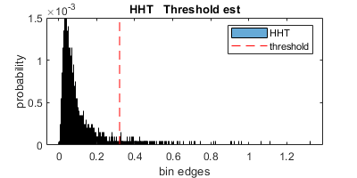
  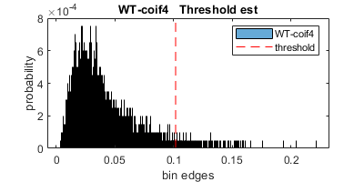<figcaption style="margin:0;">Вычисление threshold</figcaption>
   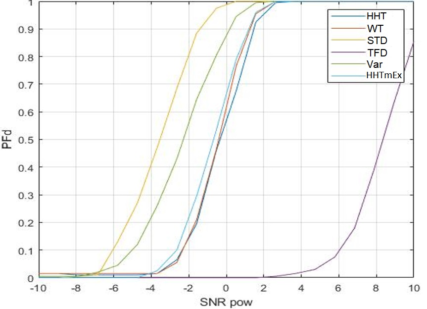<figcaption>Сравнение эфективности обнаружения</figcaption>
  - `./App2_Algorithms_real_signals.m` - обработка записанных сигналов или нескольких сигналов подряд, нужно выбрать их в соответсвии с файлом `DataAll.xlsx`. 
- `./F-algorithms` - алгоритмы; 
- `./F-functions` - функции используемые в программе, детектор, моделирование сигналов, построение гарфиков;
- `./F-inputs` - файл с настройками (используемые алгоритмы, параметры) для запуска. 

## Описание задач алгоритмов
В настоящее время ведется много исследований с целью найти оптимальный алгоритм обнаружения и анализа для сигналов в задачах радиолокационного обнаружения людей и классификации целей с помощью радиолокаторов.
 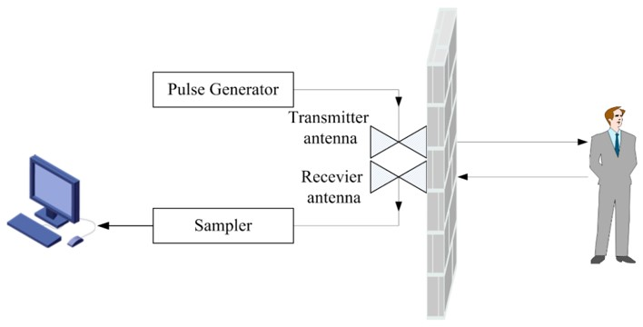 

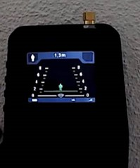 
Радиолокаторы легко обнаруживают передвижение людей по элементам радиолокацинного изображения (человек идет, бежит). Но обнаружение неподвижных людей треубет дргуих алгоритмов, т.к. полезной составляющей такого сигнала является микро-частотная модуляция в одном элементе радиолокационного изображения.

## Используемые алгоритмы
| Алгоритм                                       | Демонстрация работы на 3 записанных сигналах               |
|------------------------------------------------|------------------------------------------------------------|
| signal   compensation                      |  |
| standard   Deviation and Variation     | 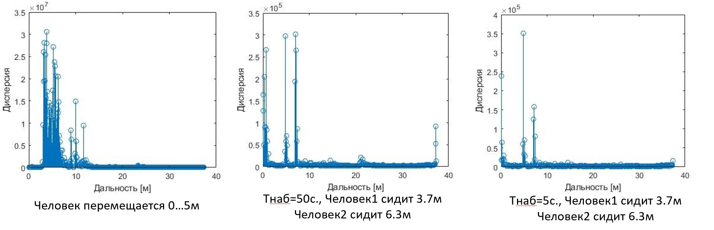 |
| FFT (Fast  Fourier Transfrom)              | 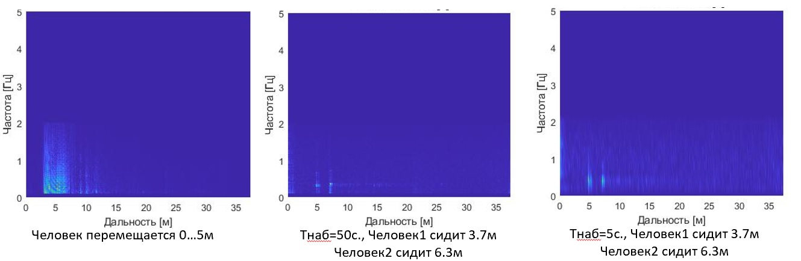 |
| 2d FFT                                         | 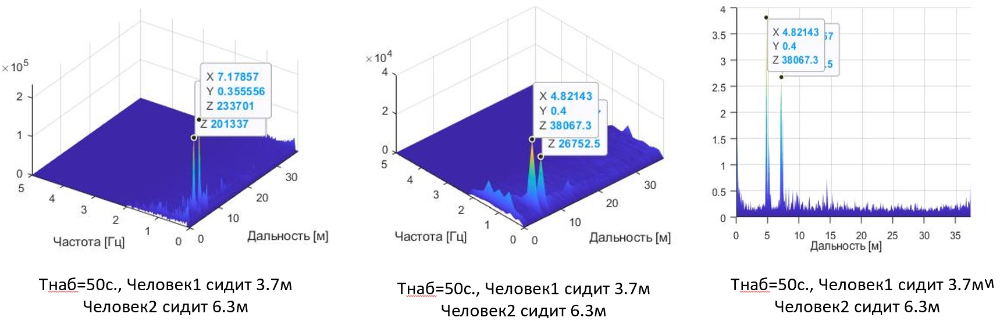 |
| WT (Wavelet  Transform)                    | 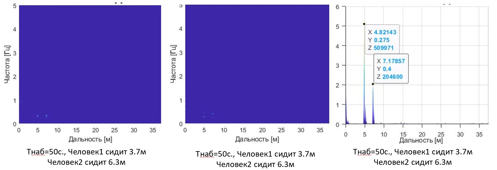 |
| HHT (Hilbert   Huang Transfrom)            | 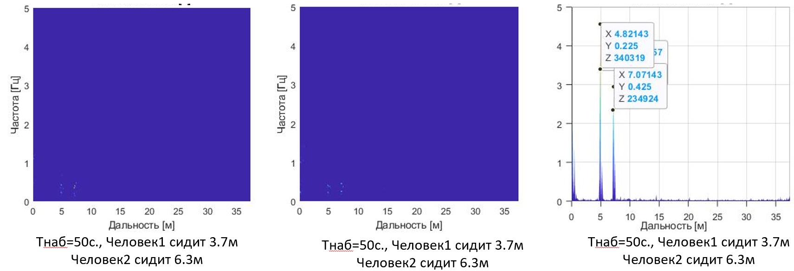 |
| HHT, WT + modes supressor (developed)  | 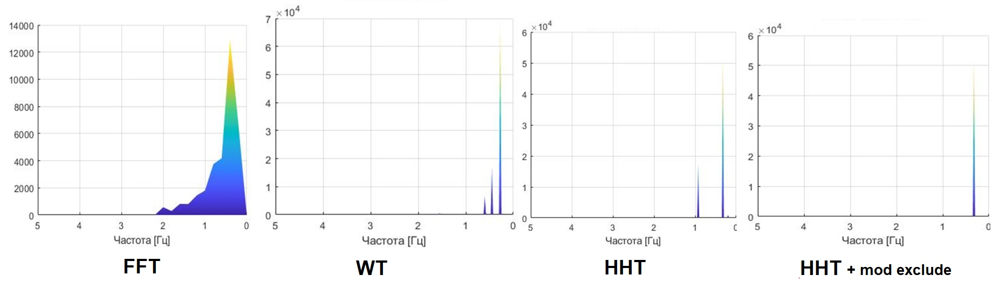 |

## Build
Для запуска программ нужен matlab не менее 2020